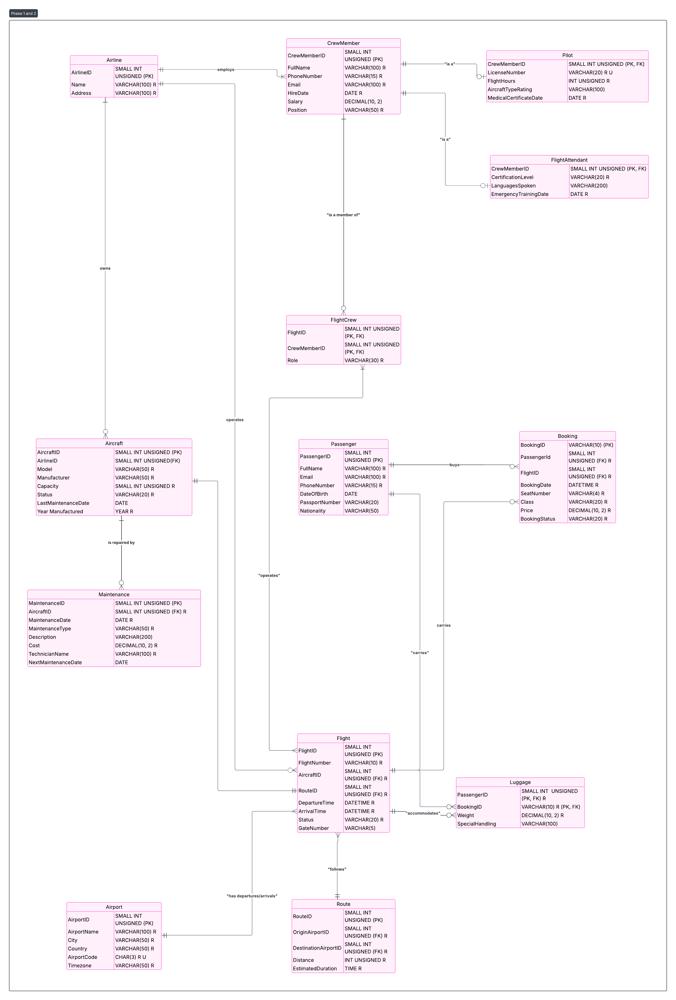

# FLIGHT MANAGEMENT DATABASE SYSTEMS PROJECT

**GROUP MEMBERS:** Derrek Dunn, Alex Miller, Stephen Railing, Trever Knie

**COP 5725: DATABASE SYSTEMS Group PROJECT**

-----

## Table of Contents

1. [INTRODUCTION](#introduction)
1. [PHASE 1 AND 2](#phase-1-and-2)
1. [PHASE 3](#phase-3)
    1. [SPECIFICATION OF THE PILOT ENTITY](#specification-of-the-pilot-entity)
    1. [CARDINALITY AND PARTICIPATION RATIO](#cardinality-and-participation-ratio)
    1. [STRONG AND WEAK ENTITIES](#strong-and-weak-entities)
    1. [SUPERTYPE AND SUBTYPE](#supertype-and-subtype)
    1. [TABLE AND COLUMNS CONSTRAINTS](#table-and-columns-constraints)
    1. [NORMALIZATION](#normalization)
1. [PHASE 4](#phase-4)
    1. [IMPLEMENTATION OF ER DIAGRAM IN MYSQL](#implementation-of-er-diagram-in-mysql)
        1. [Airport Table](#airport-table)
        1. [Aircraft Table](#aircraft-table)
        1. [CrewMember Table](#crewmember-table)
        1. [Pilot Table](#pilot-table)
        1. [FlightAttendant Table](#flightattendant-table)
        1. [Passenger Table](#passenger-table)
        1. [Route Table](#route-table)
        1. [Flight Table](#flight-table)
        1. [Booking Table](#booking-table)
        1. [Maintenance Table](#maintenance-table)
    1. [QUERIES AND OUTPUTS](#queries-and-outputs)
    1. [REVERSE ENGINEERING DIAGRAM](#reverse-engineering-diagram)

-----

## INTRODUCTION

This project was developed for COP 5725: Database Systems to demonstrate the full lifecycle of database design and implementation. Our team created a relational database for an airline management system, covering key processes such as flight scheduling, passenger management, crew assignments, aircraft maintenance, and booking operations. We began by identifying entities and relationships, then designed an EER diagram with cardinalities, strong and weak entities, and supertype-subtype structures. After defining constraints and ensuring normalization to 3NF, we implemented the system in MySQL, populated it with data, and wrote complex queries to extract meaningful insights. The project concludes with a reverse-engineered ER diagram, confirming consistency between design and implementation.

-----

## PHASE 1 AND 2



-----

## PHASE 3

### SPECIFICATION OF THE PILOT ENTITY

The database manages data for our airline company. The database has 9 useful entities. One of the entities has the following specifications.

The Pilot entity is related to the CrewMember entity, the Aircraft entity, and Flight entity. Some crew members are pilots who can operate our aircraft on various flights. Since pilots are specialized crew members, Pilot becomes a subtype of the CrewMember entity (supertype) since all pilots are also crew members in our airline. The Pilot entity has the following attributes:

- **PilotID**: This is a unique integer that identifies our pilots and becomes the Primary Key of the table.
- **FullName**: This is a required attribute that contains the pilot’s first and last name.
- **Salary**: This stores our pilot’s salaries and is optional.
- **PhoneNumber**: This is a required attribute for the pilot’s phone number since we need to contact our pilots for scheduling.
- **LicenseNumber**: This is a required attribute storing the pilot’s aviation license number.
- **FlightHours**: This required attribute tracks the total flight hours accumulated by the pilot.

The Pilot entity has a (one mandatory to mandatory many) relationship with the CrewMember entity, which is also a supertype entity. The Pilot entity has a (many mandatory to one mandatory) relationship with the Aircraft entity for aircraft assignments. It also has a (many mandatory to one mandatory) relationship with the Flight entity.

### CARDINALITY AND PARTICIPATION RATIO

#### Cardinality Table

|Entity                  |Cardinality       |Description                                              |
|------------------------|------------------|---------------------------------------------------------|
|Pilot and CrewMember    |Many to One (N:1) |Many pilots are managed under crew member classification |
|Pilot and Aircraft      |Many to One (N:1) |Many pilots can be certified for one aircraft type       |
|Pilot and Flight        |Many to One (N:1) |Many pilots can be assigned to one flight                |
|Passenger and Booking   |One to Many (1:N) |One passenger can make multiple bookings                 |
|Aircraft and Flight     |One to Many (1:N) |One aircraft can operate multiple flights                |
|Airport and Flight      |One to Many (1:N) |One airport can serve multiple departing/arriving flights|
|Flight and Booking      |Many to One (N:1) |Multiple bookings can be made for one flight             |
|CrewMember and Flight   |Many to Many (M:N)|Many crew members can work on many flights               |
|Aircraft and Maintenance|One to Many (1:N) |One aircraft can have multiple maintenance records       |
|Passenger and Luggage   |One to Many (1:N) |One passenger can have multiple luggage items            |
|Flight and Route        |Many to One (N:1) |Many flights can follow the same route                   |
|Airport and Route       |Many to One (N:1) |Many routes can originate from one airport               |
|Aircraft and Airline    |Many to One (N:1) |Many aircraft can be owned by one airline                |
|Airline and Flight      |One to Many (1:N) |One airline can operate many flights                     |
|Airline and CrewMember  |One to Many (1:N) |One ariline can employ many crew members                 |


#### Participation Ratio Table

|Entity                  |Participation Ratio                      |Description                                                                                                |
|------------------------|-----------------------------------------|-----------------------------------------------------------------------------------------------------------|
|Pilot and CrewMember    |Total/Mandatory (1), Total/Mandatory (1) |Every pilot must be a crew member and specialized crew members can be pilots                               |
|Pilot and Aircraft      |Total/Mandatory (1), Partial/Optional (0)|Each pilot must be certified for at least one aircraft type, but not all aircraft require pilot assignments|
|Pilot and Flight        |Total/Mandatory (1), Partial/Optional (0)|Each flight must have at least one pilot, but pilots may not always be on active flights                   |
|Passenger and Booking   |Total/Mandatory (1), Total/Mandatory (1) |Each booking must have a passenger and passengers must have bookings to fly                                |
|Aircraft and Flight     |Total/Mandatory (1), Partial/Optional (0)|Each flight must have an assigned aircraft, but aircraft may be grounded                                   |
|Aircraft and Maintenance|Total/Mandatory (1), Partial/Optional (0)|Each maintenance record must be for an aircraft, but aircraft may not always be in maintenance             |
|Flight and Booking      |Total/Mandatory (1), Partial/Optional (0)|Each booking must be for a specific flight, but flights may operate without bookings                       |
|CrewMember and Flight   |Total/Mandatory (1), Total/Mandatory (1) |Each flight must have crew members and crew members must be assigned to flights                            |
|Passenger and Luggage   |Total/Mandatory (1), Partial/Optional (0)|Each luggage item must belong to a passenger, but passengers may travel without checked luggage            |
|Flight and Route        |Total/Mandatory (1), Total/Mandatory (1) |Each flight must follow a route and routes exist to be flown                                               |
|Aircraft and Airline    |Total/Mandatory (1), Total/Mandatory (1) |Each aircraft must be owned by exactly one airline                                                         |
|Airline and Flight		 |Total/Mandatory (1), Total/Mandatory (1) |Each flight is operated by one airline, but an airline may have many flights				               |
|Airline and CrewMember  |Total/Mandatory (1), Total/Mandatory (1) |Each airline can have many crew members as employees                                                       |


### STRONG AND WEAK ENTITIES

There is an identifying relationship between Passenger and Booking, as well as between Aircraft and Maintenance. Per our business rules, a booking cannot exist without a passenger. Similarly, maintenance records cannot exist without an aircraft. Therefore, the Booking entity is identified by Passenger, and Maintenance entity is identified by Aircraft. The primary keys of the Passenger and Aircraft tables serve as both primary keys and foreign keys in their respective dependent tables.

### SUPERTYPE AND SUBTYPE

Pilots in our airline are specialized crew members, making the Pilot entity a subtype of the CrewMember entity (supertype). The primary key of the CrewMember table becomes the primary key of the Pilot table as well as a foreign key.

Flight attendants are also specialized crew members, making FlightAttendant entity another subtype of CrewMember entity. The primary key of the CrewMember table becomes the primary key of the FlightAttendant table as well as a foreign key.

As a business rule, we decided to allow a CrewMember to be both a Pilot and a FlightAttendant, although this may be rare in practice.

### TABLE AND COLUMNS CONSTRAINTS

#### CrewMember Table

- **Table Constraint**: Primary Key (CrewMemberID)
- **Column Constraint**: Not Null (FullName, PhoneNumber, HireDate), Check (PhoneNumber)

#### Pilot Table

- **Table Constraint**: Primary Key (CrewMemberID), Foreign Key (CrewMemberID) [On Delete Cascade On Update Cascade]
- **Column Constraint**: Not Null (LicenseNumber, FlightHours)

#### FlightAttendant Table

- **Table Constraint**: Primary Key (CrewMemberID), Foreign Key (CrewMemberID) [On Delete Cascade On Update Cascade]
- **Column Constraint**: Not Null (CertificationLevel, LanguagesSpoken)

#### Aircraft Table

- **Table Constraint**: Primary Key (AircraftID), Foreign Key (AirlineID)
- **Column Constraint**: Not Null (Model, Manufacturer, Capacity, Status)

#### Airport Table

- **Table Constraint**: Primary Key (AirportID)
- **Column Constraint**: Not Null (AirportName, City, Country, AirportCode), Unique (AirportCode)

#### Airline Table
- **Table Constraint**: Primary Key (AirlineID)
- **Column Constraint**: Not Null (Name, Address)

#### Passenger Table

- **Table Constraint**: Primary Key (PassengerID)
- **Column Constraint**: Not Null (FullName, Email, PhoneNumber), Check (PhoneNumber), Check (Email)

#### Route Table

- **Table Constraint**: Primary Key (RouteID), Foreign Key (OriginAirportID, DestinationAirportID) [On Delete Restrict On Update Cascade]
- **Column Constraint**: Not Null (Distance, EstimatedDuration)

#### Flight Table

- **Table Constraint**: Primary Key (FlightID), Foreign Key (AircraftID, RouteID) [On Delete Restrict On Update Cascade]
- **Column Constraint**: Not Null (FlightNumber, DepartureTime, ArrivalTime, Status), Unique (FlightNumber)

#### Booking Table

- **Table Constraint**: Primary Key (BookingID), Foreign Key (PassengerID, FlightID) [On Delete Cascade On Update Cascade]
- **Column Constraint**: Not Null (BookingDate, SeatNumber, Class, Price)

#### Maintenance Table

- **Table Constraint**: Primary Key (MaintenanceID), Foreign Key (AircraftID) [On Delete Cascade On Update Cascade]
- **Column Constraint**: Not Null (MaintenanceDate, MaintenanceType, Cost, TechnicianName)

#### Luggage Table

- **Table Constraint**: Primary Key (PassengerID, BookingID), Foreign Key (PassengerID, BookingID) [On Delete Cascade On Update Cascade]
- **Column Constraint**: Not Null (Weight, LuggageType)

#### FlightCrew Table (Junction Table)

- **Table Constraint**: Primary Key (FlightID, CrewMemberID), Foreign Key (FlightID, CrewMemberID) [On Delete Restrict On Update Restrict]

### NORMALIZATION

All tables are in 3NF. This ensures that:

- All attributes are atomic (1NF)
- All non-key attributes are fully functionally dependent on the primary key (2NF)
- No transitive dependencies exist between non-key attributes (3NF)

-----

## PHASE 4

### IMPLEMENTATION OF ER DIAGRAM IN MYSQL

```sql
CREATE DATABASE AIRLINE_MANAGEMENT_SYSTEM;
SHOW DATABASES;
USE AIRLINE_MANAGEMENT_SYSTEM;
```

#### Airport Table

**Table Creation**

```sql
CREATE TABLE Airport (
    AirportID SMALLINT UNSIGNED PRIMARY KEY,
    AirportName VARCHAR(100) NOT NULL,
    City VARCHAR(50) NOT NULL,
    Country VARCHAR(50) NOT NULL,
    AirportCode CHAR(3) NOT NULL UNIQUE,
    Timezone VARCHAR(50) NOT NULL
);
```

**Table Description**
This table stores information about airports in our airline network. Each airport has a unique identifier and internationally recognized airport code.

- **AirportID**: Small unsigned integer serving as primary key for unique identification
- **AirportName**: Full name of the airport (up to 100 characters)
- **City**: City where the airport is located
- **Country**: Country where the airport is located
- **AirportCode**: Three-letter IATA airport code (unique constraint ensures no duplicates)
- **Timezone**: Timezone information for scheduling purposes

**Values Insertion**

```sql
INSERT INTO Airport VALUES 
(101, 'John F. Kennedy International Airport', 'New York', 'USA', 'JFK', 'EST'),
(102, 'Los Angeles International Airport', 'Los Angeles', 'USA', 'LAX', 'PST'),
(103, 'Heathrow Airport', 'London', 'UK', 'LHR', 'GMT'),
(104, 'Charles de Gaulle Airport', 'Paris', 'France', 'CDG', 'CET'),
(105, 'Tokyo Haneda Airport', 'Tokyo', 'Japan', 'HND', 'JST');
```

#### Airline table

**Table Creation**

```sql
CREATE TABLE Airline (
    AirlineID SMALLINT UNSIGNED PRIMARY KEY,
    Name VARCHAR(100) NOT NULL,
    Address VARCHAR(100) NOT NULL,
);
```

**Table Description**
This table stores information about airports in our airline network. Each airport has a unique identifier and internationally recognized airport code.

- **AirlineID**: Small unsigned integer serving as primary key for unique identification
- **Name**: Full name of the airline (up to 100 characters)
- **Address**: Address of the airport


**Values Insertion**
````sql
INSERT INTO Airline (AirlineID, Name, Address) VALUES 
(1, 'American Airlines', '1 Skyview Dr, Fort Worth, TX 76155'),
(2, 'Delta Air Lines', '1030 Delta Blvd, Atlanta, GA 30354'),
(3, 'United Airlines', '233 S. Wacker Dr, Chicago, IL 60606'),
(4, 'Southwest Airlines', '2702 Love Field Dr, Dallas, TX 75235'),
(5, 'JetBlue Airways', '27-01 Queens Plaza N, Long Island City, NY 11101'),
(6, 'Alaska Airlines', '19300 International Blvd, Seattle, WA 98188'),
(7, 'Spirit Airlines', '2800 Executive Way, Miramar, FL 33025'),
(8, 'Frontier Airlines', '4545 Airport Way, Denver, CO 80239'),
(9, 'Allegiant Air', '1201 N Town Center Dr, Las Vegas, NV 89144'),
(10, 'Hawaiian Airlines', '3375 Koapaka St, Honolulu, HI 96819');
````

#### Aircraft Table

**Table Creation**

```sql
CREATE TABLE Aircraft (
    AircraftID SMALLINT UNSIGNED PRIMARY KEY,
    Model VARCHAR(50) NOT NULL,
    Manufacturer VARCHAR(50) NOT NULL,
    Capacity SMALLINT UNSIGNED NOT NULL,
    Status VARCHAR(20) NOT NULL,
    LastMaintenanceDate DATE,
    YearManufactured YEAR NOT NULL
);
```

**Table Description**
Stores information about aircraft in the fleet, including specifications and operational status.

- **AircraftID**: Unique identifier for each aircraft
- **Model**: Aircraft model (e.g., “Boeing 737”, “Airbus A320”)
- **Manufacturer**: Company that manufactured the aircraft
- **Capacity**: Maximum passenger capacity
- **Status**: Current operational status (Active, Maintenance, Retired)
- **LastMaintenanceDate**: Date of most recent maintenance
- **YearManufactured**: Year the aircraft was built

**Values Insertion**

```sql
INSERT INTO Aircraft VALUES 
(201, 'Boeing 737-800', 'Boeing', 162, 'Active', '2024-11-15', 2018),
(202, 'Airbus A320', 'Airbus', 156, 'Active', '2024-12-01', 2019),
(203, 'Boeing 777-200', 'Boeing', 314, 'Maintenance', '2024-10-20', 2017),
(204, 'Airbus A330', 'Airbus', 277, 'Active', '2024-11-28', 2020),
(205, 'Boeing 787-9', 'Boeing', 290, 'Active', '2024-12-10', 2021);
```

#### CrewMember Table

**Table Creation**

```sql
CREATE TABLE CrewMember (
    CrewMemberID SMALLINT UNSIGNED PRIMARY KEY,
    FullName VARCHAR(100) NOT NULL,
    PhoneNumber VARCHAR(15) NOT NULL,
    CHECK (LENGTH(PhoneNumber) >= 10),
    Email VARCHAR(100) NOT NULL,
    HireDate DATE NOT NULL,
    Salary DECIMAL(10,2),
    Position VARCHAR(50) NOT NULL
);
```

**Table Description**
Stores information about all crew members including pilots, flight attendants, and other airline personnel.

- **CrewMemberID**: Unique identifier for each crew member
- **FullName**: Complete name of crew member
- **PhoneNumber**: Contact phone number with validation for minimum length
- **Email**: Email address for communication
- **HireDate**: Date when crew member was hired
- **Salary**: Annual salary (optional)
- **Position**: Job position/role

**Values Insertion**

```sql
INSERT INTO CrewMember VALUES 
(301, 'Captain James Mitchell', '555-123-4567',
 'j.mitchell@airline.com', '2015-03-15', 125000.00, 'Captain'),
(302, 'First Officer Sarah Chen', '555-234-5678',
 's.chen@airline.com', '2018-07-20', 85000.00, 'First Officer'),
(303, 'Flight Attendant Maria Rodriguez', '555-345-6789',
 'm.rodriguez@airline.com', '2019-02-10', 45000.00, 'Senior Flight Attendant'),
(304, 'Captain Robert Wilson', '555-456-7890',
 'r.wilson@airline.com', '2012-09-05', 130000.00, 'Captain'),
(305, 'Flight Attendant Kevin Park', '555-567-8901',
 'k.park@airline.com', '2020-11-12', 42000.00, 'Flight Attendant');
```

#### Pilot Table

**Table Creation**

```sql
CREATE TABLE Pilot (
    CrewMemberID SMALLINT UNSIGNED PRIMARY KEY,
    LicenseNumber VARCHAR(20) NOT NULL UNIQUE,
    FlightHours INT UNSIGNED NOT NULL DEFAULT 0,
    AircraftTypeRating VARCHAR(100),
    MedicalCertificationDate DATE NOT NULL,
    FOREIGN KEY (CrewMemberID) REFERENCES CrewMember(CrewMemberID) 
        ON DELETE CASCADE ON UPDATE CASCADE
);
```

**Table Description**
Specialized table for pilots, inheriting from CrewMember with pilot-specific attributes.

- **CrewMemberID**: Primary key that references CrewMember table
- **LicenseNumber**: Unique pilot license identifier
- **FlightHours**: Total accumulated flight hours
- **AircraftTypeRating**: Types of aircraft pilot is certified to fly
- **MedicalCertificationDate**: Date of last medical certification

**Values Insertion**

```sql
INSERT INTO Pilot VALUES 
(301, 'ATP-123456789', 8500, 'Boeing 737, Boeing 777', '2024-06-15'),
(302, 'CPL-987654321', 3200, 'Airbus A320, Airbus A330', '2024-08-20'),
(304, 'ATP-456789123', 12000, 'Boeing 737, Boeing 777, Boeing 787', '2024-05-10');
```

#### FlightAttendant Table

**Table Creation**

```sql
CREATE TABLE FlightAttendant (
    CrewMemberID SMALLINT UNSIGNED PRIMARY KEY,
    CertificationLevel VARCHAR(20) NOT NULL,
    LanguagesSpoken VARCHAR(200),
    EmergencyTrainingDate DATE NOT NULL,
    FOREIGN KEY (CrewMemberID) REFERENCES CrewMember(CrewMemberID) 
        ON DELETE CASCADE ON UPDATE CASCADE
);
```

**Table Description**
Specialized table for flight attendants with attendant-specific qualifications.

- **CrewMemberID**: Primary key referencing CrewMember
- **CertificationLevel**: Level of flight attendant certification
- **LanguagesSpoken**: Languages the attendant can speak
- **EmergencyTrainingDate**: Date of last emergency training

**Values Insertion**

```sql
INSERT INTO FlightAttendant VALUES 
(303, 'Senior', 'English, Spanish, French', '2024-09-15'),
(305, 'Standard', 'English, Korean, Mandarin', '2024-10-22');
```

#### Passenger Table

**Table Creation**

```sql
CREATE TABLE Passenger (
    PassengerID SMALLINT UNSIGNED PRIMARY KEY,
    FullName VARCHAR(100) NOT NULL,
    Email VARCHAR(100) NOT NULL,
    CHECK (Email LIKE '%@%'),
    PhoneNumber VARCHAR(15) NOT NULL,
    CHECK (LENGTH(PhoneNumber) >= 10),
    DateOfBirth DATE,
    PassportNumber VARCHAR(20),
    Nationality VARCHAR(50)
);
```

**Table Description**
Stores passenger information for booking and identification purposes.

- **PassengerID**: Unique identifier for each passenger
- **FullName**: Complete passenger name
- **Email**: Email address with basic format validation
- **PhoneNumber**: Contact number with minimum length check
- **DateOfBirth**: Passenger’s birth date
- **PassportNumber**: International passport identifier
- **Nationality**: Passenger’s nationality

**Values Insertion**

```sql
INSERT INTO Passenger VALUES 
(401, 'John Anderson', 'john.anderson@email.com', '555-111-2222',
 '1985-04-12', 'US123456789', 'American'),
(402, 'Lisa Wang', 'lisa.wang@email.com', '555-222-3333',
 '1990-08-25', 'CN987654321', 'Chinese'),
(403, 'Pierre Dubois', 'pierre.dubois@email.com', '555-333-4444',
 '1978-12-03', 'FR456789123', 'French'),
(404, 'Emma Thompson', 'emma.thompson@email.com', '555-444-5555',
 '1992-06-18', 'UK789123456', 'British'),
(405, 'Carlos Rivera', 'carlos.rivera@email.com', '555-555-6666',
 '1988-09-30', 'MX321654987', 'Mexican');
```

#### Route Table

**Table Creation**

```sql
CREATE TABLE Route (
    RouteID SMALLINT UNSIGNED PRIMARY KEY,
    OriginAirportID SMALLINT UNSIGNED NOT NULL,
    DestinationAirportID SMALLINT UNSIGNED NOT NULL,
    Distance INT UNSIGNED NOT NULL,
    EstimatedDuration TIME NOT NULL,
    FOREIGN KEY (OriginAirportID) REFERENCES Airport(AirportID) 
        ON DELETE RESTRICT ON UPDATE CASCADE,
    FOREIGN KEY (DestinationAirportID) REFERENCES Airport(AirportID) 
        ON DELETE RESTRICT ON UPDATE CASCADE,
    CHECK (OriginAirportID != DestinationAirportID)
);
```

**Table Description**
Defines flight routes between airports with distance and duration information.

- **RouteID**: Unique identifier for each route
- **OriginAirportID**: Starting airport
- **DestinationAirportID**: Destination airport
- **Distance**: Flight distance in nautical miles
- **EstimatedDuration**: Expected flight time
- **CHECK constraint**: Ensures origin and destination are different airports

**Values Insertion**

```sql
INSERT INTO Route VALUES 
(501, 101, 102, 2445, '06:00:00'),  -- JFK to LAX
(502, 102, 103, 5440, '11:30:00'),  -- LAX to LHR
(503, 103, 104, 214, '01:15:00'),   -- LHR to CDG
(504, 104, 105, 6053, '12:45:00'),  -- CDG to HND
(505, 101, 103, 3459, '07:30:00');  -- JFK to LHR
```

#### Flight Table

**Table Creation**

```sql
CREATE TABLE Flight (
    FlightID SMALLINT UNSIGNED PRIMARY KEY,
    FlightNumber VARCHAR(10) NOT NULL UNIQUE,
    AircraftID SMALLINT UNSIGNED NOT NULL,
    RouteID SMALLINT UNSIGNED NOT NULL,
    AirlineID SMALLINT UNSIGNED NOT NULL,
    DepartureTime DATETIME NOT NULL,
    ArrivalTime DATETIME NOT NULL,
    Status VARCHAR(20) NOT NULL DEFAULT 'Scheduled',
    GateNumber VARCHAR(5),
    FOREIGN KEY (AircraftID) REFERENCES Aircraft(AircraftID) 
        ON DELETE RESTRICT ON UPDATE CASCADE,
    FOREIGN KEY (RouteID) REFERENCES Route(RouteID) 
        ON DELETE RESTRICT ON UPDATE CASCADE,
    FOREIGN KEY (AirlineID) REFERENCES Airline(AirlineID)
        ON DELETE RESTRICT ON UPDATE CASCADE,
    CHECK (ArrivalTime > DepartureTime)
);
```

**Table Description**
Represents scheduled flights with timing, aircraft, and route information.

- **FlightID**: Unique flight identifier
- **FlightNumber**: Airline flight number (unique)
- **AircraftID**: Aircraft assigned to flight
- **RouteID**: Route the flight follows
- **DepartureTime**: Scheduled departure date/time
- **ArrivalTime**: Scheduled arrival date/time
- **Status**: Current flight status
- **GateNumber**: Departure gate assignment

**Values Insertion**

```sql
INSERT INTO Flight VALUES 
(601, 'AA101', 201, 501, 1, '2024-12-20 08:00:00',
 '2024-12-20 14:00:00', 'Scheduled', 'A12'),
(602, 'DL202', 202, 502, 2, '2024-12-21 15:30:00',
 '2024-12-22 03:00:00', 'Scheduled', 'B7'),
(603, 'UA303', 204, 503, 3, '2024-12-22 09:15:00',
 '2024-12-22 10:30:00', 'Scheduled', 'C3'),
(604, 'SW404', 205, 504, 4, '2024-12-23 11:00:00',
 '2024-12-24 23:45:00', 'Scheduled', 'D15'),
(605, 'JB505', 203, 505, 5, '2024-12-24 20:30:00',
 '2024-12-25 04:00:00', 'Delayed', 'A8');
```

#### Booking Table

**Table Creation**

```sql
CREATE TABLE Booking (
    BookingID VARCHAR(10) PRIMARY KEY,
    PassengerID SMALLINT UNSIGNED NOT NULL,
    FlightID SMALLINT UNSIGNED NOT NULL,
    BookingDate DATETIME NOT NULL,
    SeatNumber VARCHAR(4) NOT NULL,
    Class VARCHAR(20) NOT NULL,
    Price DECIMAL(8,2) NOT NULL,
    BookingStatus VARCHAR(20) NOT NULL DEFAULT 'Confirmed',
    FOREIGN KEY (PassengerID) REFERENCES Passenger(PassengerID) 
        ON DELETE CASCADE ON UPDATE CASCADE,
    FOREIGN KEY (FlightID) REFERENCES Flight(FlightID) 
        ON DELETE CASCADE ON UPDATE CASCADE,
    UNIQUE(FlightID, SeatNumber)
);
```

**Table Description**
Records passenger bookings for specific flights with seat assignments and pricing.

- **BookingID**: Unique booking reference
- **PassengerID**: Reference to passenger making booking
- **FlightID**: Reference to booked flight
- **BookingDate**: When booking was made
- **SeatNumber**: Assigned seat
- **Class**: Travel class (Economy, Business, First)
- **Price**: Ticket price
- **BookingStatus**: Current booking status

**Values Insertion**

```sql
INSERT INTO Booking VALUES 
('BK001', 401, 601, '2024-11-15 10:30:00', '12A',
 'Economy', 450.00, 'Confirmed'),
('BK002', 402, 602, '2024-11-20 14:15:00', '3B',
 'Business', 1200.00, 'Confirmed'),
('BK003', 403, 603, '2024-12-01 09:45:00', '15C',
 'Economy', 180.00, 'Confirmed'),
('BK004', 404, 604, '2024-12-05 16:20:00', '1A',
 'First', 2800.00, 'Confirmed'),
('BK005', 405, 605, '2024-12-10 11:10:00', '8D',
 'Economy', 520.00, 'Confirmed');
```

#### Maintenance Table

**Table Creation**

```sql
CREATE TABLE Maintenance (
    MaintenanceID SMALLINT UNSIGNED AUTO_INCREMENT,
    AircraftID SMALLINT UNSIGNED NOT NULL,
    MaintenanceDate DATE NOT NULL,
    MaintenanceType VARCHAR(50) NOT NULL,
    Description TEXT,
    Cost DECIMAL(10,2) NOT NULL,
    TechnicianName VARCHAR(100) NOT NULL,
    NextMaintenanceDate DATE,
    PRIMARY KEY (MaintenanceID, AircraftID),
    FOREIGN KEY (AircraftID) REFERENCES Aircraft(AircraftID) 
        ON DELETE CASCADE ON UPDATE CASCADE
);
```

**Table Description**
Tracks maintenance activities performed on aircraft for safety and compliance.

- **MaintenanceID**: Auto-incrementing maintenance record ID
- **AircraftID**: Aircraft that received maintenance
- **MaintenanceDate**: Date maintenance was performed
- **MaintenanceType**: Type of maintenance (Routine, Repair, Inspection)
- **Description**: Detailed maintenance description
- **Cost**: Cost of maintenance work
- **TechnicianName**: Lead technician responsible
- **NextMaintenanceDate**: When next maintenance is due

**Values Insertion**

```sql
INSERT INTO Maintenance (AircraftID, MaintenanceDate, MaintenanceType,
 Description, Cost, TechnicianName, NextMaintenanceDate) VALUES 
(201, '2024-11-15', 'Routine', 'Engine inspection and oil change',
 5500.00, 'Mike Johnson', '2025-02-15'),
(202, '2024-12-01', 'Repair', 'Landing gear hydraulic system repair',
 12000.00, 'Sarah Davis', '2025-03-01'),
(203, '2024-10-20', 'Major Overhaul', 'Complete engine overhaul',
 85000.00, 'Robert Chen', '2025-04-20'),
(204, '2024-11-28', 'Routine', 'Avionics system check',
 3200.00, 'Lisa Park', '2025-02-28'),
(205, '2024-12-10', 'Inspection', 'Annual safety inspection',
 8500.00, 'David Wilson', '2025-12-10');
```

#### Luggage Table

**Table Creation**

```sql
CREATE TABLE Luggage (
    BookingID VARCHAR(10) NOT NULL,
    PassengerID SMALLINT UNSIGNED NOT NULL,
    Weight DECIMAL(5,2) NOT NULL,
    LuggageType VARCHAR(20) NOT NULL,
    SpecialHandling VARCHAR(100),
    PRIMARY KEY (PassengerID, BookingID),
    FOREIGN KEY (BookingID) REFERENCES Booking(BookingID) 
        ON DELETE CASCADE ON UPDATE CASCADE,
    FOREIGN KEY (PassengerID) REFERENCES Passenger(PassengerID) 
        ON DELETE CASCADE ON UPDATE CASCADE,
    CHECK (Weight > 0)
);
```

**Table Description**
Tracks luggage items associated with passenger bookings.

- **BookingID**: Associated booking reference
- **PassengerID**: Passenger who owns the luggage
- **Weight**: Luggage weight in kilograms
- **LuggageType**: Type (Checked, Carry-on, Oversized)
- **SpecialHandling**: Any special handling requirements

**Values Insertion**

```sql
INSERT INTO Luggage (BookingID, PassengerID, Weight, LuggageType, SpecialHandling) VALUES 
('BK001', 401, 23.5, 'Checked', NULL),
('BK001', 401, 7.2, 'Carry-on', NULL),
('BK002', 402, 18.3, 'Checked', 'Fragile Items'),
('BK003', 403, 25.1, 'Checked', NULL),
('BK004', 404, 15.8, 'Checked', 'Priority'),
('BK005', 405, 28.7, 'Checked', 'Heavy');
```

#### FlightCrew Table (Junction Table)

**Table Creation**

```sql
CREATE TABLE FlightCrew (
    FlightID SMALLINT UNSIGNED NOT NULL,
    CrewMemberID SMALLINT UNSIGNED NOT NULL,
    Role VARCHAR(30) NOT NULL,
    PRIMARY KEY (FlightID, CrewMemberID),
    FOREIGN KEY (FlightID) REFERENCES Flight(FlightID) 
        ON DELETE RESTRICT ON UPDATE RESTRICT,
    FOREIGN KEY (CrewMemberID) REFERENCES CrewMember(CrewMemberID) 
        ON DELETE RESTRICT ON UPDATE RESTRICT
);
```

**Table Description**
Junction table linking flights with their assigned crew members and roles.

- **FlightID**: Reference to flight
- **CrewMemberID**: Reference to crew member
- **Role**: Specific role for this flight (Captain, First Officer, Flight Attendant)

**Values Insertion**

```sql
INSERT INTO FlightCrew VALUES 
(601, 301, 'Captain'),
(601, 302, 'First Officer'),
(601, 303, 'Senior Flight Attendant'),
(602, 304, 'Captain'),
(602, 305, 'Flight Attendant'),
(603, 301, 'Captain'),
(603, 303, 'Senior Flight Attendant'),
(604, 302, 'First Officer'),
(604, 305, 'Flight Attendant'),
(605, 304, 'Captain');
```

-----

### QUERIES AND OUTPUTS

#### 1. Passenger Contact Information and Flight Details

We need to contact passengers about their upcoming flights and want to know their booking details and contact information.

```sql
SELECT 
    p.FullName,
    p.PhoneNumber,
    p.Email,
    f.FlightNumber,
    b.SeatNumber,
    b.Class,
    b.Price,
    f.DepartureTime,
    f.ArrivalTime
FROM 
    Passenger p
JOIN 
    Booking b ON p.PassengerID = b.PassengerID
JOIN 
    Flight f ON b.FlightID = f.FlightID
ORDER BY 
    f.DepartureTime;
```

```
('John Anderson', '555-111-2222', 'john.anderson@email.com', 'AA101',
 '12A', 'Economy', 450, '2024-12-20 08:00:00', '2024-12-20 14:00:00')
('Lisa Wang', '555-222-3333', 'lisa.wang@email.com', 'AA102',
 '3B', 'Business', 1200, '2024-12-21 15:30:00', '2024-12-22 03:00:00')
('Pierre Dubois', '555-333-4444', 'pierre.dubois@email.com', 'AA103',
 '15C', 'Economy', 180, '2024-12-22 09:15:00', '2024-12-22 10:30:00')
('Emma Thompson', '555-444-5555', 'emma.thompson@email.com', 'AA104',
 '1A', 'First', 2800, '2024-12-23 11:00:00', '2024-12-24 23:45:00')
('Carlos Rivera', '555-555-6666', 'carlos.rivera@email.com', 'AA105',
 '8D', 'Economy', 520, '2024-12-24 20:30:00', '2024-12-25 04:00:00')
```

#### 2. Aircraft Maintenance Status and Costs

The maintenance department wants to review recent maintenance activities, costs, and identify aircraft that may need attention based on their last maintenance date.

```sql
SELECT
    a.Model,
    a.Manufacturer,
    a.Status AS AircraftStatus,
    m.MaintenanceDate,
    m.MaintenanceType,
    m.Cost,
    m.TechnicianName,
    m.NextMaintenanceDate
FROM
    Aircraft a
LEFT JOIN
    Maintenance m ON a.AircraftID = m.AircraftID
ORDER BY
    a.Model, m.MaintenanceDate DESC;
```

```
('Airbus A320', 'Airbus', 'Active', '2024-12-01',
 'Repair', 12000, 'Sarah Davis', '2025-03-01')
('Airbus A330', 'Airbus', 'Active', '2024-11-28',
 'Routine', 3200, 'Lisa Park', '2025-02-28')
('Boeing 737-800', 'Boeing', 'Active', '2024-11-15',
 'Routine', 5500, 'Mike Johnson', '2025-02-15')
('Boeing 777-200', 'Boeing', 'Maintenance', '2024-10-20',
 'Major Overhaul', 85000, 'Robert Chen', '2025-04-20')
('Boeing 787-9', 'Boeing', 'Active', '2024-12-10',
 'Inspection', 8500, 'David Wilson', '2025-12-10')
```

#### 3. Flights and Crew Assignments
We need to see which crew members are assigned to specific flights, including their roles and contact information, for staffing and operational planning.
```sql
SELECT
    f.FlightNumber,
    f.DepartureTime,
    f.ArrivalTime,
    cm.FullName AS CrewMemberName,
    fc.Role,
    cm.PhoneNumber,
    cm.Email
FROM
    Flight f
JOIN
    FlightCrew fc ON f.FlightID = fc.FlightID
JOIN
    CrewMember cm ON fc.CrewMemberID = cm.CrewMemberID
ORDER BY
    f.FlightNumber, fc.Role;
```

```
('AA101', '2024-12-20 08:00:00', '2024-12-20 14:00:00',
 'Captain James Mitchell', 'Captain',
 '555-123-4567', 'j.mitchell@airline.com')
('AA101', '2024-12-20 08:00:00', '2024-12-20 14:00:00',
 'First Officer Sarah Chen', 'First Officer',
 '555-234-5678', 's.chen@airline.com')
('AA101', '2024-12-20 08:00:00', '2024-12-20 14:00:00',
 'Flight Attendant Maria Rodriguez', 'Senior Flight Attendant',
 '555-345-6789', 'm.rodriguez@airline.com')
('AA102', '2024-12-21 15:30:00', '2024-12-22 03:00:00',
 'Captain Robert Wilson', 'Captain',
 '555-456-7890', 'r.wilson@airline.com')
('AA102', '2024-12-21 15:30:00', '2024-12-22 03:00:00',
 'Flight Attendant Kevin Park', 'Flight Attendant',
 '555-567-8901', 'k.park@airline.com')
('AA103', '2024-12-22 09:15:00', '2024-12-22 10:30:00',
 'Captain James Mitchell', 'Captain',
 '555-123-4567', 'j.mitchell@airline.com')
('AA103', '2024-12-22 09:15:00', '2024-12-22 10:30:00',
 'Flight Attendant Maria Rodriguez', 'Senior Flight Attendant',
 '555-345-6789', 'm.rodriguez@airline.com')
('AA104', '2024-12-23 11:00:00', '2024-12-24 23:45:00',
 'First Officer Sarah Chen', 'First Officer',
 '555-234-5678', 's.chen@airline.com')
('AA104', '2024-12-23 11:00:00', '2024-12-24 23:45:00',
 'Flight Attendant Kevin Park', 'Flight Attendant',
 '555-567-8901', 'k.park@airline.com')
('AA105', '2024-12-24 20:30:00', '2024-12-25 04:00:00',
 'Captain Robert Wilson', 'Captain',
 '555-456-7890', 'r.wilson@airline.com')
```
#### 4. Pilots' Flight Hours and Aircraft Type Ratings
The flight operations department wants to track pilots' total flight hours and their certified aircraft type ratings for training and assignment purposes.
```sql
SELECT
    cm.FullName AS PilotName,
    p.LicenseNumber,
    p.FlightHours,
    p.AircraftTypeRating,
    p.MedicalCertificationDate
FROM
    Pilot p
JOIN
    CrewMember cm ON p.CrewMemberID = cm.CrewMemberID
ORDER BY
    p.FlightHours DESC;
```

```
('Captain Robert Wilson', 'ATP-456789123', 12000, 'Boeing 737, Boeing 777, Boeing 787',
 '2024-05-10')
('Captain James Mitchell', 'ATP-123456789', 8500, 'Boeing 737, Boeing 777',
 '2024-06-15')
('First Officer Sarah Chen', 'CPL-987654321', 3200, 'Airbus A320, Airbus A330',
 '2024-08-20')
```
#### 5. Passenger Luggage Details for a Specific Flight
For flight operations and baggage handling, we need to quickly retrieve all luggage details for passengers on a specific flight, including weight and special handling notes.
```sql
SELECT
    p.FullName AS PassengerName,
    b.BookingID,
    l.Weight,
    l.LuggageType,
    l.SpecialHandling,
    f.FlightNumber
FROM
    Luggage l
JOIN
    Booking b ON l.BookingID = b.BookingID
JOIN
    Passenger p ON l.PassengerID = p.PassengerID
JOIN
    Flight f ON b.FlightID = f.FlightID
WHERE
    f.FlightNumber = 'AA101' -- Example: replace with desired FlightNumber
ORDER BY
    p.FullName, l.BookingID, l.PassengerID;
```

```
('John Anderson', 'BK001', None, 23.5, 'Checked', None, 'AA101')
('John Anderson', 'BK001', None, 7.2, 'Carry-on', None, 'AA101')
```
#### 6. Revenue by Flight Class
To analyze revenue performance, we need to calculate the total revenue generated for each flight class.
```sql
SELECT
    Class,
    SUM(Price) AS TotalRevenue
FROM
    Booking
GROUP BY
    Class
ORDER BY
    TotalRevenue DESC;
```

```
('First', 2800)
('Business', 1200)
('Economy', 1150)
```

#### 7. Flights Departing from a Specific Airport
For airport operations and passenger information, we want to list all flights scheduled to depart from a specific airport.
```sql
SELECT
    f.FlightNumber,
    a.AirportName AS OriginAirport,
    r.EstimatedDuration,
    f.DepartureTime,
    f.ArrivalTime,
    f.Status
FROM
    Flight f
JOIN
    Route r ON f.RouteID = r.RouteID
JOIN
    Airport a ON r.OriginAirportID = a.AirportID
WHERE
    a.AirportCode = 'JFK' -- Example: replace with desired AirportCode
ORDER BY
    f.DepartureTime;
```

```
('AA101', 'John F. Kennedy International Airport', '06:00:00',
 '2024-12-20 08:00:00', '2024-12-20 14:00:00', 'Scheduled')
('AA105', 'John F. Kennedy International Airport', '07:30:00',
 '2024-12-24 20:30:00', '2024-12-25 04:00:00', 'Delayed')
```
#### 8. Aircraft with Pending Maintenance or Recent Major Overhauls
The engineering department wants to identify aircraft that are either due for maintenance or have recently undergone major overhauls.
```sql
SELECT
    a.AircraftID,
    a.Model,
    a.Manufacturer,
    a.Status AS AircraftStatus,
    m.MaintenanceDate,
    m.MaintenanceType,
    m.NextMaintenanceDate
FROM
    Aircraft a
LEFT JOIN
    Maintenance m ON a.AircraftID = m.AircraftID
WHERE
    a.Status = 'Maintenance' OR m.MaintenanceType = 'Major Overhaul'
ORDER BY
    a.AircraftID, m.MaintenanceDate DESC;
```

```
(203, 'Boeing 777-200', 'Boeing', 'Maintenance', 
'2024-10-20', 'Major Overhaul', '2025-04-20')
```
#### 9. Crew Members Assigned to Multiple Flights
To optimize crew scheduling, we need to identify crew members who are assigned to more than one flight within a specific period.
```sql
SELECT
    cm.FullName AS CrewMemberName,
    cm.Position,
    COUNT(fc.FlightID) AS NumberOfFlightsAssigned
FROM
    CrewMember cm
JOIN
    FlightCrew fc ON cm.CrewMemberID = fc.CrewMemberID
WHERE
    fc.FlightID IN (SELECT FlightID FROM Flight WHERE
	DepartureTime BETWEEN '2024-12-20' AND '2024-12-25') -- Example: adjust date range
GROUP BY
    cm.CrewMemberID, cm.FullName, cm.Position
HAVING
    COUNT(fc.FlightID) > 1
ORDER BY
    NumberOfFlightsAssigned DESC;
```

```
('Captain James Mitchell', 'Captain', 2)
('First Officer Sarah Chen', 'First Officer', 2)
('Flight Attendant Maria Rodriguez', 'Senior Flight Attendant', 2)
('Captain Robert Wilson', 'Captain', 2)
('Flight Attendant Kevin Park', 'Flight Attendant', 2)
```
#### 10. Top 3 Most Expensive Bookings
Management wants to see the top 3 most expensive bookings to understand premium travel trends.
```sql
SELECT
    b.BookingID,
    p.FullName AS PassengerName,
    f.FlightNumber,
    b.Class,
    b.Price,
    b.BookingDate
FROM
    Booking b
JOIN
    Passenger p ON b.PassengerID = p.PassengerID
JOIN
    Flight f ON b.FlightID = f.FlightID
ORDER BY
    b.Price DESC
LIMIT 3;
```

```
('BK004', 'Emma Thompson', 'AA104', 'First', 2800, '2024-12-05 16:20:00')
('BK002', 'Lisa Wang', 'AA102', 'Business', 1200, '2024-11-20 14:15:00')
('BK005', 'Carlos Rivera', 'AA105', 'Economy', 520, '2024-12-10 11:10:00')
```
### REVERSE ENGINEERING DIAGRAM
